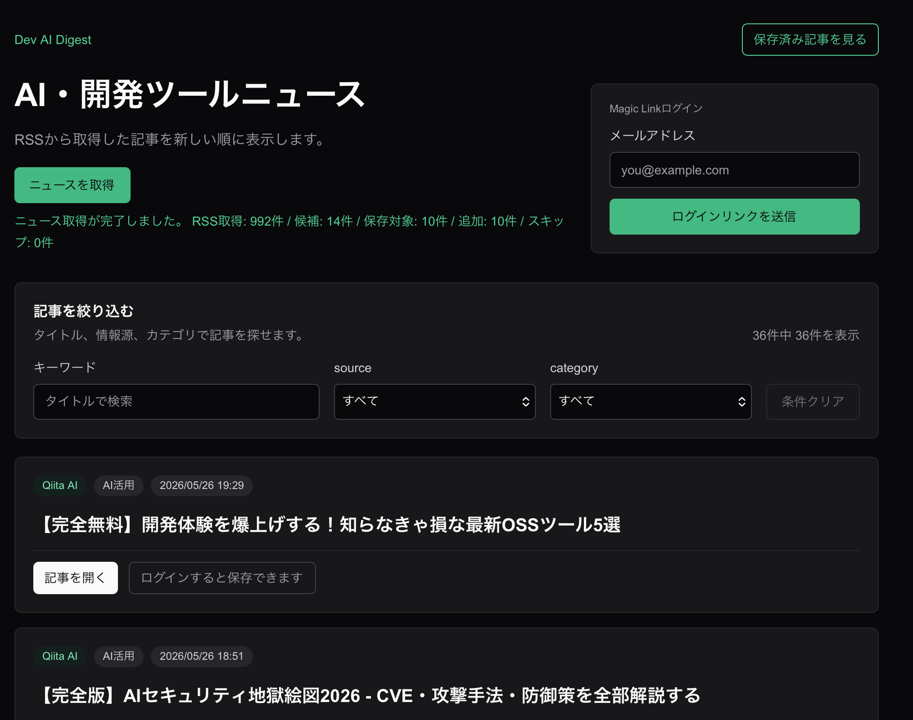
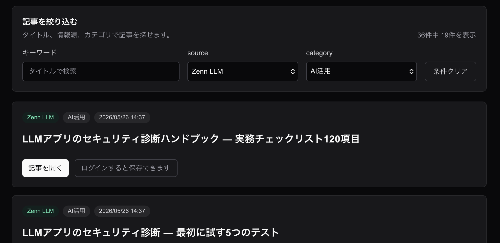
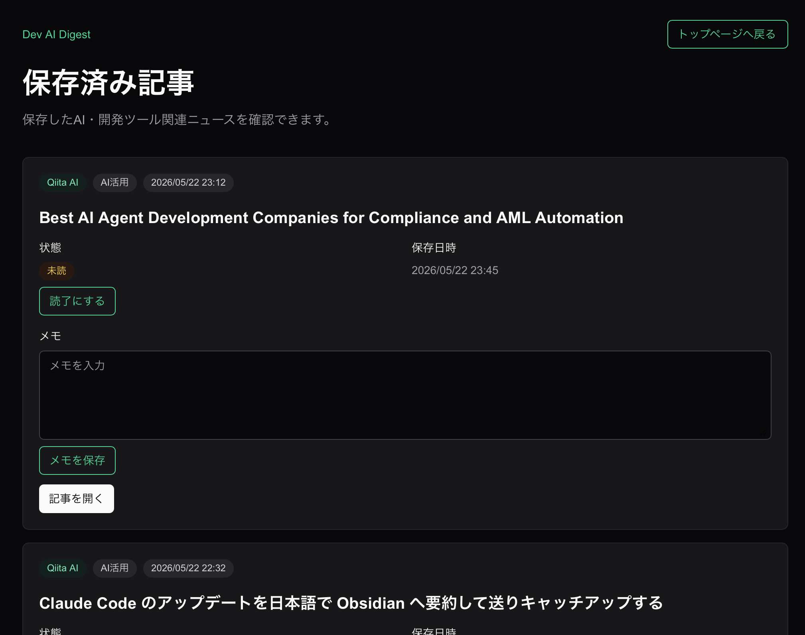
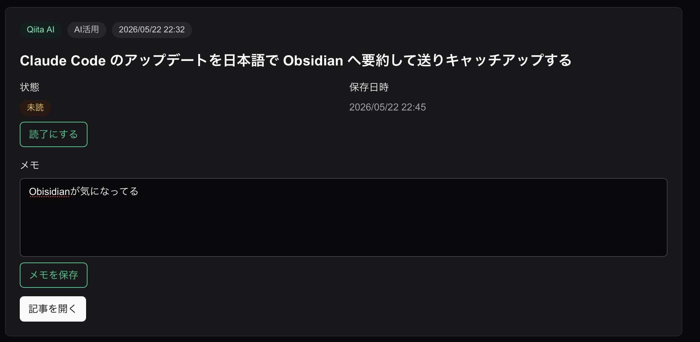

# Dev AI Digest

Dev AI Digestは、AI・開発ツール関連ニュースをRSSから取得し、検索・保存・読了管理・メモ編集、日次AI要約の生成ができるニュースダッシュボードです。Next.js / TypeScript / Supabase / Vercelを使用し、RSS取得、Gemini APIによるAI要約、Magic Linkログイン、RLSを前提としたユーザー別の保存記事管理を実装しています。

## 作成目的

AI時代のフロントエンドエンジニアとして、日々増えるAI・開発ツール関連情報を自分で探し回らずに確認し、気になる記事を保存して、自分の学びやあとで試したいこととして整理できるようにするために作成しています。

## デプロイURL

- Production: https://dev-ai-digest-atox08h2m-jimon-airs-projects.vercel.app/

## 主な機能

現在実装済みの主な機能は以下です。

- RSSからの記事取得
- 記事一覧表示
- 記事検索・絞り込み
- Gemini APIによる日次AIニュースまとめ生成
- Vercel Cronによる日次AIニュースまとめの自動生成
- トップページでの最新AI要約表示
- Supabase AuthによるMagic Linkログイン
- ログイン中ユーザーの記事保存
- 保存済み記事一覧
- 保存済み記事の読了 / 未読管理
- 保存済み記事のステータスフィルター
- 保存済み記事のメモ編集
- 保存済み記事の保存解除

## 現在できること

- RSS取得
- 記事一覧
- 検索・絞り込み
- AI要約生成
- AI要約の毎朝自動生成
- 最新AI要約表示
- Magic Linkログイン
- 記事保存
- 保存済み記事一覧
- 読了 / 未読切り替え
- すべて / 未読 / 読了フィルター
- メモ編集
- 保存解除

## Screenshots

### 記事一覧

RSSから取得したAI・開発ツール関連ニュースを一覧で確認できます。

### 検索・絞り込み

タイトル検索、source、categoryによる絞り込みで、読みたい記事を探せます。

### 保存済み記事管理

保存した記事は `/saved` で確認でき、読了/未読の切り替え、メモ編集、保存解除ができます。

### メモ編集

気になった記事に自分用メモを残し、あとで学びや試したいことを振り返れます。

## RSS取得機能

Dev AI Digestでは、固定RSSフィードから記事を取得し、`articles` テーブルに保存します。

### 対象RSSフィード

現在は以下の固定RSSフィードを対象にしています。

- OpenAI News
- Zenn LLM
- Qiita AI

### 取得方法

- トップページの「ニュースを取得」ボタンから手動でRSS取得を実行します
- ボタン押下時に `POST /api/fetch-news` を呼び出します
- Route Handler内でRSS取得・パース・DB保存を行います
- RSSのパースには `rss-parser` を使用しています
- `articles.url` のunique制約により、同じ記事の重複登録を防ぎます

### 取得件数の制限

RSS取得時は、保存対象が増えすぎないように以下の制限をかけています。

- 各RSSフィードごとに最大5件まで候補化
- 全フィード合算後、全体最大10件まで保存対象化
- `published_at` がある記事は新しい順を優先
- URLまたはtitleがない記事は除外
- 同一取得内のURL重複は1件化

## 検索・絞り込み

トップページの記事一覧では、取得済み記事に対して以下の検索・絞り込みができます。

- タイトル検索
- `source` での絞り込み
- `category` での絞り込み
- 条件クリア

検索・絞り込みは、現時点ではクライアント側で行っています。将来的に記事数が増えた場合は、Supabase側のクエリ検索へ移行する想定です。

## AI要約機能

Dev AI Digestでは、Gemini APIを使って直近記事から日次AIニュースまとめを生成できます。

- トップページに最新のAI要約を表示します
- 要約が未生成の場合は、トップページの「AI要約を生成」ボタンから生成できます
- ボタン押下時に `POST /api/generate-summary` を呼び出します
- Route Handler内で直近記事を取得し、Gemini APIで要約を生成します
- 生成結果は `daily_ai_summaries` テーブルに保存します
- 同じ日の要約が既にある場合は再生成せず、既存要約を返します
- 要約本文はMarkdown風テキストとして、改行を活かして表示します

### AI要約の自動生成

Vercel Cronを使い、日次AIニュースまとめを毎朝自動生成します。

- Cron用エンドポイントとして `GET /api/cron/generate-summary` を使用します
- Vercel Cronの設定では `0 22 * * *` を指定しています
- UTC 22:00 実行のため、JSTでは翌朝7:00相当です
- Cron用エンドポイントでは `Authorization: Bearer <CRON_SECRET>` による簡易認証を行います
- 認証に使う値は環境変数 `CRON_SECRET` に設定します
- 内部的には通常のAI要約生成処理を呼び出し、同じ日の要約が既にある場合は既存要約を返します

## 保存済み記事管理

ログイン中ユーザーは、トップページの記事一覧から気になる記事を保存できます。

- `/saved` で自分が保存した記事を一覧表示できます
- `/saved` で「すべて / 未読 / 読了」を切り替えて表示できます
- 保存済み記事は読了 / 未読を切り替えられます
- 保存済み記事に自分用メモを残せます
- 不要になった保存済み記事は保存解除できます
- 読了状態は `saved_articles.status` に保存します
- メモは `saved_articles.memo` に保存します

## DB設計

### articles

RSSから取得した記事本体を保存する共通テーブルです。

主なカラム：

- id
- title
- url
- source
- category
- published_at
- fetched_at
- created_at

設計方針：

- `url` にunique制約を設定して重複登録を防ぎます
- 記事一覧は未ログインでも閲覧可能です
- クライアントからの直接insert / update / deleteは許可しません
- RSS取得Route Handler経由で記事を追加します

### saved_articles

ユーザーごとの保存記事情報を管理するテーブルです。

主なカラム：

- id
- user_id
- article_id
- status
- memo
- created_at
- updated_at

設計方針：

- `user_id` と `article_id` の組み合わせにunique制約を設定します
- 同じユーザーが同じ記事を重複保存しないようにします
- `status` は `unread` / `read` の2種類です
- `memo` はユーザーごとのメモです
- RLSにより本人だけが操作可能です
- 記事本体とユーザー固有の保存状態を分けることで、RSS取得データと個人の管理データを切り分けます

### daily_ai_summaries

Gemini APIで生成した日次AIニュースまとめを保存するテーブルです。

主なカラム：

- id
- summary_date
- title
- summary
- article_count
- model
- created_at

設計方針：

- `summary_date` にunique制約を設定し、同じ日の要約を重複生成しないようにします
- 最新のAI要約はトップページに表示します
- クライアントからの直接insert / update / deleteは許可しません
- AI要約生成Route Handler経由で要約を追加します

## セキュリティ / RLS方針

### articles

- 未ログインユーザーも記事一覧を閲覧できます
- クライアントからのinsert / update / deleteは許可しません
- 記事追加はRSS取得Route Handler経由で行います
- RSS取得Route Handlerではサーバー側で `SUPABASE_SERVICE_ROLE_KEY` を使用します
- `SUPABASE_SERVICE_ROLE_KEY` は `NEXT_PUBLIC_` を付けず、ブラウザに公開しません

### saved_articles

- ログインユーザー本人だけがselect / insert / update / deleteできます
- `saved_articles` にはauthenticatedロールへの必要なgrantを付与しています
- RLSにより、保存状態・読了状態・メモは本人だけが操作できます

### daily_ai_summaries

- 未ログインユーザーもAI要約を閲覧できます
- クライアントからのinsert / update / deleteは許可しません
- AI要約生成は `POST /api/generate-summary` 経由で行います
- Vercel Cronからの自動生成は `GET /api/cron/generate-summary` 経由で行います
- Cron用エンドポイントは `CRON_SECRET` による簡易認証を行います
- AI要約生成Route Handlerではサーバー側で `SUPABASE_SERVICE_ROLE_KEY` を使用します

## 技術スタック

- Next.js
- TypeScript
- Supabase
- Supabase Auth
- Supabase RLS
- Gemini API
- Vercel
- Tailwind CSS
- rss-parser

## 環境変数

RSS取得機能とAI要約機能では、既存のSupabase接続情報に加えて、サーバー側で以下の環境変数を使用します。

- `SUPABASE_SERVICE_ROLE_KEY`
- `GEMINI_API_KEY`
- `GEMINI_SUMMARY_MODEL`
- `CRON_SECRET`

注意点：

- `SUPABASE_SERVICE_ROLE_KEY` はサーバー側専用です
- `GEMINI_API_KEY` はサーバー側専用です
- `GEMINI_SUMMARY_MODEL` は未設定の場合、Route Handler側で `gemini-2.5-flash-lite` を使用します
- `CRON_SECRET` はVercel Cron用エンドポイントの簡易認証に使用します
- `NEXT_PUBLIC_` を付けないでください
- `.env.local` に設定し、Gitにはコミットしないでください

## v1では未対応

以下はv1ではまだ実装しない、または今後の拡張として扱う予定です。

- LINE通知
- Vercel CronによるRSS自動取得
- ユーザーごとのRSSフィード追加
- 記事本文スクレイピング
- 取得履歴テーブル
- 高度なレコメンド
- ページネーション
- Markdown対応
- 自動保存

## 既知の課題

- Production環境で React hydration mismatch error #418 が発生する場合があります
- 日付表示の決定化、保存ボタンの初回表示安定化、記事一覧のclient-only化などの対策は実施済みです
- Preview環境では解消するケースもあり、Production環境特有の差分として継続調査予定です
- 現時点ではv1の主要機能確認とポートフォリオ化を優先します

## 今後の拡張

- React #418 の追加調査
- 毎朝のLINE通知
- Vercel Cronによる定期取得
- RSSソースの見直し
- Qiita Popularなど話題記事フィードの追加
- UI改善
- Vercel本番デプロイ
